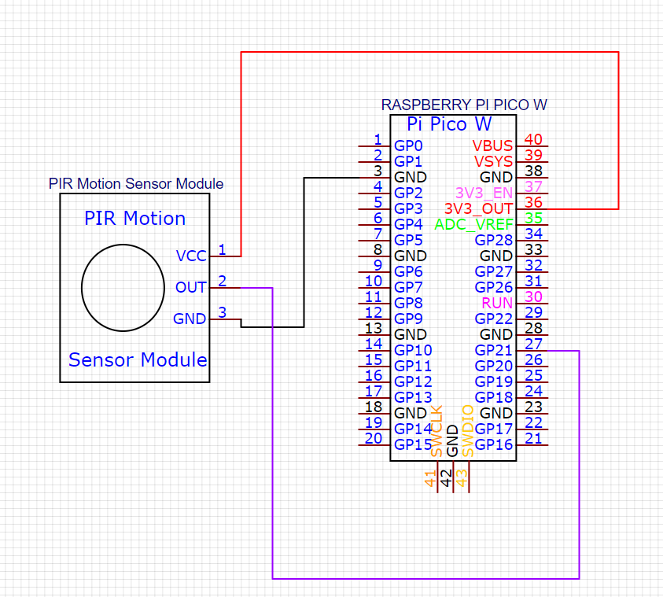

= SHELLY-MOVEMENT-SENSOR
Stevan Vlajic
1.0.0, {docdate}: Me Myself and I 
//:toc-placement!:  // prevents the generation of the doc at this position, so it can be printed afterwards
:sourcedir: ../src/main/java
:icons: font
:sectnums:    // Nummerierung der Überschriften / section numbering
:toc: left
:experimental:

== ABOUT

=== MOVEMENT-SENSOR
I've created a movement sensor on my own with:

* Rapberry Pico W 
* PIR-Motion Sensor

You can find the code for the sensor in `/movement-sensor/`

=== API-SERVER
The second part of this project is the api-server which is listening to the movement-sensor and turns on/off the shelly devices.

== SETUP

=== MOVEMENT-SENSOR
 
First of all you need to get:

* link:https://www.amazon.com/-/de/dp/B07KZW86YR/ref=sr_1_3?crid=O4P9OUEX1CYS&keywords=PIR+SENSOR&qid=1676111159&sprefix=pir+sensor+%2Caps%2C244&sr=8-3[PIR-MOTION-SENSOR]

* link:https://www.amazon.com/-/de/dp/B0BGJK781Z/ref=sr_1_4?__mk_de_DE=%C3%85M%C3%85%C5%BD%C3%95%C3%91&crid=3Q6ZWOPG2752Q&keywords=5+raspberry+pi+pico+w&qid=1676112258&sprefix=5raspberry+pi+pico+%2Caps%2C194&sr=8-4[RASPBERRY-PI-PICO-W]

Now you need to connect the PIR-MOTION-SENSOR with the RASPBERRY PI PICO W. To do that you will need to follow the instructions in the picture:

